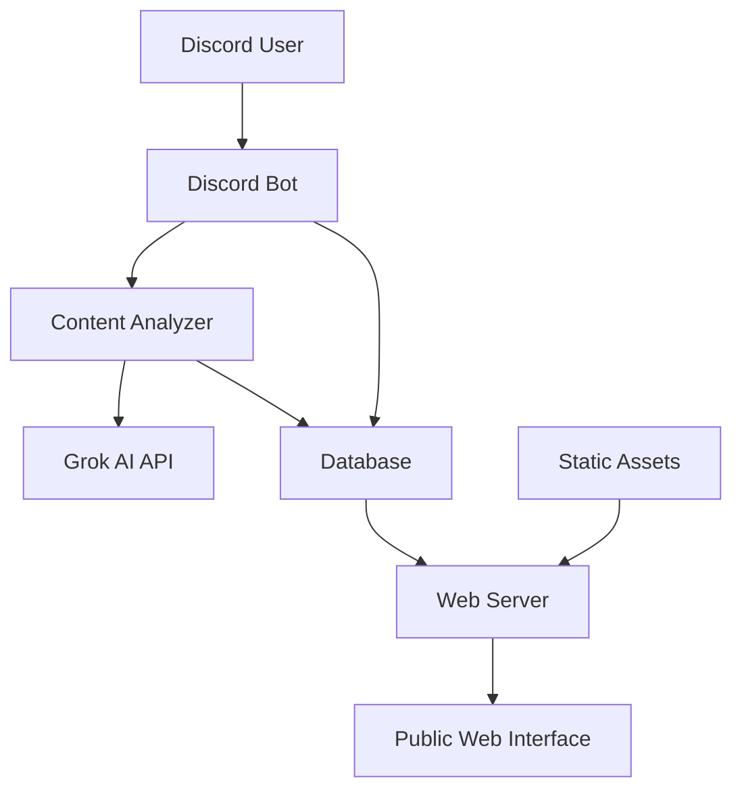
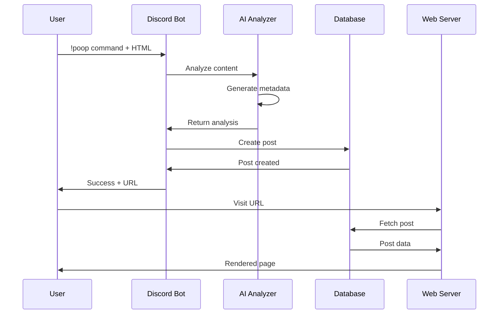

# Poop Quest - Project Planning Document

## Executive Summary

Poop Quest is a Discord-to-Web content sharing platform that allows users to submit HTML content via Discord bot commands, processes it through AI for metadata generation, and publishes it as branded web posts. The project combines real-time Discord bot interaction with a public web interface, creating a unique content publishing workflow.

## Problem Statement

Content creators and developers often want to quickly share HTML content, prototypes, or code snippets with a broader audience but lack an easy way to:
- Transform raw HTML into polished, branded web posts
- Generate SEO-optimized metadata automatically
- Create shareable URLs from Discord submissions
- Maintain consistent branding across shared content

## Solution Overview

Poop Quest solves this by providing:
1. **Discord Bot Interface** - `!poop` command for HTML content submission
2. **AI-Powered Analysis** - Grok AI generates titles, descriptions, and slugs
3. **Web Publishing Platform** - Branded EJS templates with SEO optimization
4. **Database Persistence** - SQLite storage for all posts and metadata

## Success Metrics

- **Functionality**: All core features working end-to-end
- **Performance**: <3 second response time for Discord commands
- **Reliability**: 99% uptime, graceful error handling
- **Security**: HTML sanitization, rate limiting, input validation
- **Test Coverage**: >80% unit test coverage
- **Documentation**: Complete setup and usage documentation

## User Story Scenarios

### Primary User Flow
```
User submits HTML → Discord bot processes → AI analyzes → Web post created → URL shared
```

### Detailed User Stories

1. **Content Creator**
   - "As a developer, I want to share HTML prototypes quickly via Discord"
   - "As a blogger, I want AI to generate SEO metadata for my content"
   - "As a designer, I want consistent branding on all shared content"

2. **Web Visitor**
   - "As a visitor, I want to view content in a clean, branded interface"
   - "As a reader, I want proper SEO metadata for social sharing"
   - "As a mobile user, I want responsive design"

3. **Administrator**
   - "As an admin, I want to monitor bot usage and performance"
   - "As a maintainer, I want proper error logging and debugging"

## System Architecture

### High-Level Architecture


### Component Breakdown

#### Core Components
1. **Discord Bot Service** (`src/bot/`)
   - Command handlers (`!poop`, `!help`, `!stats`)
   - File upload processing
   - User interaction management
   - Error handling and retry logic

2. **Web Server Service** (`src/web/`)
   - Express.js application
   - EJS template rendering
   - API endpoints
   - Security middleware

3. **AI Analysis Service** (`src/ai/`)
   - Grok AI client integration
   - Content analysis and metadata generation
   - Prompt template management
   - Fallback handling

4. **Database Service** (`src/database/`)
   - SQLite connection management
   - Post model and CRUD operations
   - Migration system
   - Connection pooling

5. **Utility Services** (`src/utils/`)
   - HTML sanitization
   - Slug generation and validation
   - Security helpers
   - File processing

### Data Flow


## Technical Specifications

### Technology Stack
- **Runtime**: Node.js 18+ with ES modules
- **Framework**: Express.js with EJS templating
- **Database**: SQLite with sqlite3 package
- **Discord**: Discord.js v14
- **AI**: Grok API from x.ai
- **Security**: Helmet, CORS, Rate limiting, DOMPurify
- **Testing**: Jest with Supertest
- **Deployment**: Docker, Akash Network

### Environment Configuration
```
DISCORD_BOT_TOKEN=<discord_bot_token>
GROK_API_KEY=<grok_api_key>
PORT=3000
NODE_ENV=development
DATABASE_PATH=./data/posts.db
BASE_URL=http://localhost:3000
```

### Database Schema
```sql
CREATE TABLE posts (
    id INTEGER PRIMARY KEY AUTOINCREMENT,
    slug TEXT UNIQUE NOT NULL,
    title TEXT NOT NULL,
    description TEXT NOT NULL,
    html_content TEXT NOT NULL,
    discord_user_id TEXT NOT NULL,
    discord_username TEXT NOT NULL,
    created_at DATETIME DEFAULT CURRENT_TIMESTAMP,
    updated_at DATETIME DEFAULT CURRENT_TIMESTAMP
);
```

## Implementation Strategy

### Phase 1: Core Infrastructure ✅ COMPLETED
- [x] Main application orchestration
- [x] Discord bot setup and event handling
- [x] Web server with Express.js
- [x] Database connection and models
- [x] Basic routing and middleware

### Phase 2: Feature Implementation ✅ COMPLETED
- [x] Discord command handlers
- [x] AI content analysis integration
- [x] HTML sanitization and processing
- [x] EJS template system
- [x] Post creation workflow

### Phase 3: Testing & Polish 🔄 IN PROGRESS
- [ ] Unit tests for all components
- [ ] Integration tests for workflows
- [ ] Error handling validation
- [ ] Performance optimization
- [ ] Security audit

### Phase 4: Deployment & Documentation 📋 PENDING
- [ ] Docker configuration
- [ ] Akash deployment setup
- [ ] User documentation
- [ ] API documentation
- [ ] Monitoring setup

## Current Implementation Status

### ✅ Completed Components
1. **Main Application** (`index.js`) - Application lifecycle management
2. **Discord Bot** (`src/bot/discord-bot.js`) - Complete bot with commands
3. **Web Server** (`src/web/server.js`) - Full Express setup with security
4. **Database Layer** (`src/database/connection.js`, `models/post.js`) - SQLite operations
5. **Poop Command** (`src/bot/commands/poop.js`) - Main command handler
6. **Content Analyzer** (`src/ai/content-analyzer.js`) - AI integration
7. **Layout Template** (`views/layout.ejs`) - Branded web layout

### 🔄 In Progress
1. **Testing Infrastructure** - Jest configuration needs implementation
2. **Missing Dependencies** - Some imported modules need creation
3. **Static Assets** - CSS, JS, and image files
4. **Error Pages** - 404 and error view templates

### 📋 Pending
1. **API Documentation** - OpenAPI specification
2. **User Guide** - Discord bot usage instructions
3. **Deployment Scripts** - Docker and Akash configuration
4. **Monitoring** - Health checks and logging

## Quality Assurance

### Testing Strategy
- **Unit Tests**: Every function and class
- **Integration Tests**: Full workflow testing
- **Security Tests**: Input validation, XSS prevention
- **Performance Tests**: Load testing, memory usage
- **E2E Tests**: Discord to web complete flows

### Code Quality
- **ESLint**: Standard configuration
- **Type Safety**: JSDoc annotations
- **Security**: OWASP compliance
- **Documentation**: Comprehensive inline docs

## Deployment Architecture

### Docker Configuration
```dockerfile
FROM node:18-alpine
WORKDIR /app
COPY package*.json ./
RUN npm ci --only=production
COPY . .
EXPOSE 3000
CMD ["npm", "start"]
```

### Akash Network Deployment
- **Compute**: 1 CPU, 2GB RAM
- **Storage**: 10GB persistent for database
- **Network**: HTTP/HTTPS ingress
- **Health Checks**: `/health` endpoint

## Security Considerations

### Input Validation
- HTML content sanitization with DOMPurify
- SQL injection prevention with parameterized queries
- Command injection prevention
- File upload validation

### Rate Limiting
- Discord command rate limiting per user
- Web API rate limiting per IP
- Database connection limits

### Content Security
- CSP headers for XSS prevention
- HTTPS enforcement in production
- Secure cookie configuration
- Input length limits

## Performance Optimization

### Database Optimization
- Indexes on frequently queried fields
- Connection pooling
- Prepared statements
- Query optimization

### Caching Strategy
- Static asset caching
- Database query caching
- API response caching
- CDN integration

### Resource Management
- Memory usage monitoring
- Connection cleanup
- Graceful shutdown handling
- Error recovery patterns

## Monitoring & Observability

### Health Checks
- Database connectivity
- AI API availability
- Discord bot status
- Memory and CPU usage

### Logging
- Structured logging with levels
- Error tracking and alerting
- Performance metrics
- User activity logs

### Metrics
- Response times
- Error rates
- User engagement
- Resource utilization

## Future Enhancements

### Phase 5: Advanced Features
- [ ] User authentication and profiles
- [ ] Content moderation tools
- [ ] Advanced AI features (image generation, translation)
- [ ] Analytics dashboard
- [ ] API for third-party integrations

### Phase 6: Scaling
- [ ] Multi-database support
- [ ] Microservices architecture
- [ ] Kubernetes deployment
- [ ] Global CDN integration
- [ ] Real-time notifications

## Risk Assessment

### Technical Risks
- **AI API Dependency**: Grok API availability and rate limits
- **Database Scaling**: SQLite limitations for high volume
- **Discord API Changes**: Breaking changes in Discord.js
- **Security Vulnerabilities**: XSS, injection attacks

### Mitigation Strategies
- Fallback metadata generation
- Database migration path to PostgreSQL
- Regular dependency updates
- Security audit and testing

## Team Roles & Responsibilities

### Development Team
- **Full-Stack Developer**: Core implementation
- **DevOps Engineer**: Deployment and monitoring
- **Security Specialist**: Security audit and testing
- **QA Engineer**: Testing and quality assurance

### Current Phase Focus
The project is currently in **Phase 3: Testing & Polish** with focus on:
1. Completing missing dependencies
2. Implementing comprehensive test suite
3. Adding missing static assets and templates
4. Security and performance validation
5. Documentation completion

## Next Steps

1. **Complete Missing Files** - Implement remaining utility functions
2. **Test Suite Development** - Create comprehensive unit and integration tests
3. **Static Assets** - Add CSS, JavaScript, and image files
4. **Error Handling** - Implement proper error pages and fallbacks
5. **Performance Testing** - Load testing and optimization
6. **Security Audit** - Vulnerability assessment
7. **Documentation** - User guides and API documentation
8. **Deployment Preparation** - Docker and Akash configuration